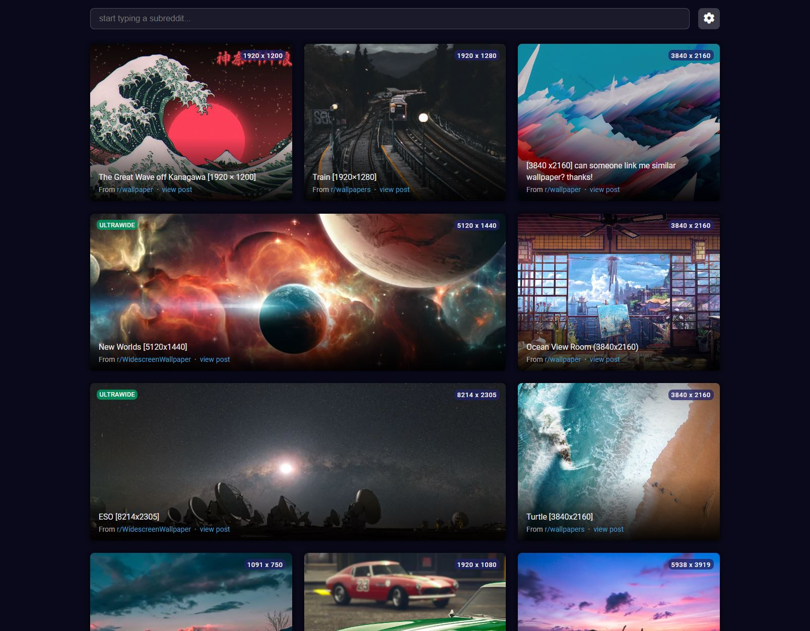

# RedditWal

<small>Updated: Merged sister repository. Read more about it here [MERGED.md](MERGED.md).</small>

Check the live web app here: [https://gauravjot.github.io/react-reddit-wallpapers/](https://gauravjot.github.io/react-reddit-wallpapers/).

## Features

-   Browse popular image based subreddits.
-   Infinite scrolling for easy exploring.
-   No ads whatsoever.
-   Download highest qaulity images only.

## Preview

## Running Locally

Install Nodejs from https://nodejs.org/en/download/ and then clone the repository. `cd` into the directory and run following commands.

-   Run _`npm install`_
-   Run _`npm start`_

The project should be running on `localhost:3000`.

To build project run _`npm run-script build`_.
